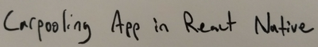

I’ve been trying to learn React and React-Native for a while now. I find myself following along Udemy courses and other tutorials, doing things I really don’t understand, and then eventually having a fully functional app that I can say I made, but I really have no idea how or why everything works. I find the best way for me to learn is by trying to build something from the ground up and trudging through bugs. Time efficient? Probably not but its more fun than sitting in front of a screen watching hours of video content.

I’ve tried to build basic React and React-Native web and mobile apps, but when I try to add anything above basic functionality I get stuck and end up copying and pasting code to avoid learning.

To improve my React-Native skills, I’m going to try build a rather ambitious app and hopefully I'll understand more about React on the way.

<strong>App Idea</strong>

I want to build a fully functional carpooling app in React Native. My little twist of originality will be that drivers will be able to list a few different options of payment (a pack of beer, 60 cents a mile, a breakfast sandwich, or choose from rider's available payment options), and riders will be able to choose from driver options or offer their own payment options (will pay per mile, will rake your lawn, clean your gutters, or cook you and your wife dinner).

<strong>Waze Carpool Looks Dope</strong>

I was rather inspired recently when I downloaded ([Waze’s Carpool](https://www.waze.com/carpool/)) app. From what I understand from the marketing material on their website, they are only up and running in California for now, but plan on expanding to other urban areas in the US.

<strong>What I Love About ([Waze’s Carpool](https://www.waze.com/carpool/)) App</strong>

-Waze’s brand is awesome (no one likes sitting in traffic and they try reduce that)

-Waze lives in Google so that kind of provides me false sense of security with everything they do

-First ride for riders is free (who doesn’t love free stuff)

-On Waze’s Carpool website, they explain that riders pay something like 60 cents a mile, not to make Waze or the driver money, but to simply pay for the gas driver will be burning

-Waze explains why carpooling is eco-friendly, saves driver and saves rider money, and builds a sense of community rather than sustaining the ridiculous, "this is a black car, you are my servant/driver, and I am a posh rider/customer" relationship in community

<strong>Carpooling Does Not Stink</strong>

If public transport doesn't provide a reasonable commute time from your trendy neighborhood in the city to that corporate park twenty miles outside of the city then carpooling is a great option. You build relationships with people in your neighborhood, the rider and the driver save money, and you have someone to talk to on the way to and back from work. My last job was located in San Mateo, CA, about twenty miles outside of my trendy neighborhood in San Francisco, CA. If the weather was decent, which it is about 9 times out of 10 in San Francisco (light drizzle of rain is still decent if you bring a change of clothes to work/can shower near work), I was happy to bike to the train to get to San Mateo.

When the weather was bad, my manager and others were nice enough to offer me rides to work. I built numerous long lasting friendships with coworkers who were nice enough to drop me off on their ways home in exchange for a beer once in a while and decent conversation while stuck in traffic. You also learn a lot about a coworker who lives near you (their personality and how they value you as a person) when you ask them to delay their life by five minutes to drop you off.

<strong>Car Commercials Trigger Me</strong>

I don't want to own a car. My parents have a car sitting in their driveway and offered it to me. I don't want it. I think owning a car is a pain in the ass. Simple as that. Its annoying, expensive, and I view it as a huge time/money suck. Owning a car is nothing like car commercials lead you to believe. Three of the top 10 advertisers in the US are car companies and the automative industry is easily the highest paying advertiser in the US. My theory on why public transport systems in the US continues to get their funds gutted is because bureaucrats are happy to continue collecting about 25% of their tax revenues from car buyers/drivers.

<strong>The Status Symbol of Having a Car - I don't buy it</strong>

The digital commercials I see from car companies glamorize guys with Elvis hair going 60 miles an hour from their mansion in the suburbs through the backroads to the city to pick up their model girlfriend/wives, and you can easily find parking outside of your favorite restaurant. After dinner, you can zoom right on home.

In reality, your hair is thinner than it was yesterday, you live in an apartment, you have to go to court for reckless driving because you got caught going 15 MPH over the speed limit, you're single, you spend 15 minutes looking for parking outside of your favorite restaurant, and you don't zoom home after dinner, the warning light is on in your car and after 600 bucks the mechanic tells you some pipe you never heard of burst in your engine. Even if buying a Lexus fixes most of your problems its not going to grow your hair back for you. Oh yea, that car you bought lost about $10,000 of value the day you drove it off the lot.

I just moved to Boston for a new job. Part of the reason I moved to Boston is that I don't need to buy and maintain a car. My place of work is located an 18 minute drive/45 minute bike ride/hour-and-a-half train-bus commute. I'm looking forward to biking even when its cold and carpooling the days its raining hard or snows on the ground.

I guess it's time to stop writing and time to start that React-Native app.
